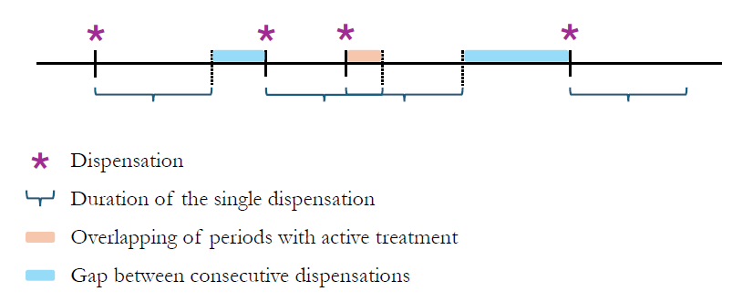
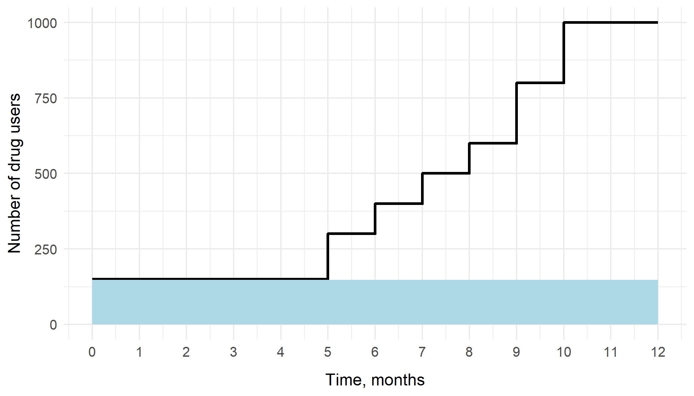
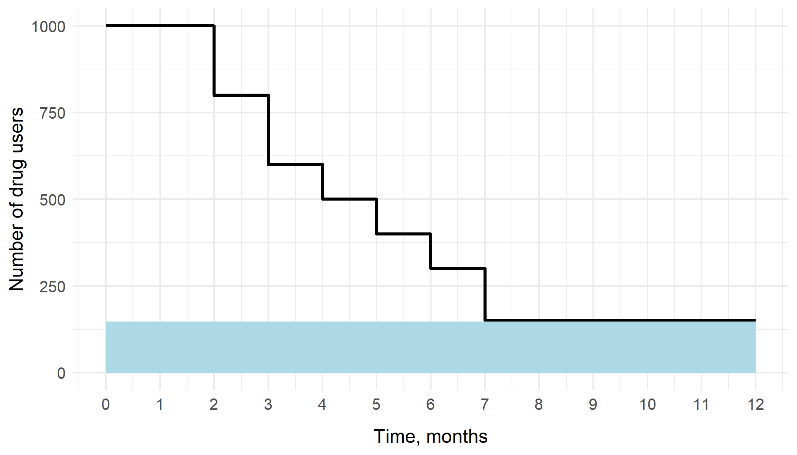
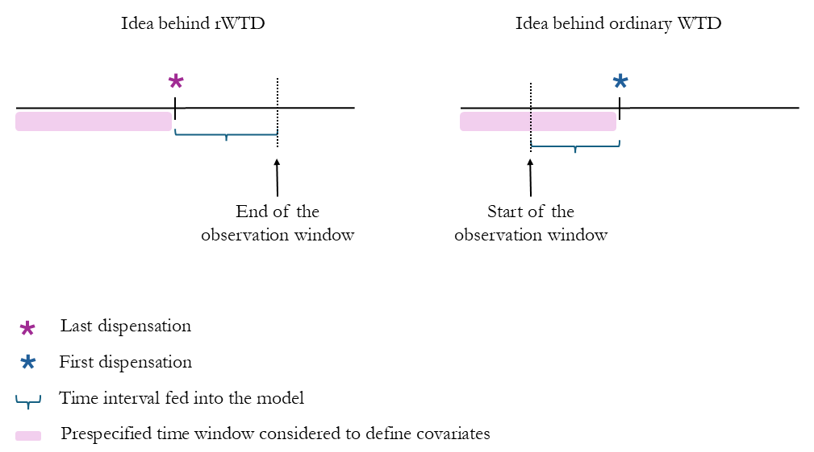

```{r, include = FALSE}
knitr::opts_chunk$set(
  collapse = TRUE,
  comment = "#>"
)
```

```{r setup, include = FALSE}
library(wtdr)
```
Contact:

Dr Malcolm B. Gillies

School of Population Health

UNSW Sydney, Australia

malcolm.gillies@unsw.edu.au


# Purpose

The definition of treatment episodes is fundamental in
pharmacoepidemiology, irrespective of whether a study involves drug
utilization, effectiveness or safety. Typically, pharmacoepidemiological
studies are based on secondary use of data sources containing
information on dispensations or prescriptions, alongside other details.
Throughout this paper, we will refer to such entries as 'dispensations',
encompassing both prescriptions and dispensations as instances of
recorded events for medicine supply. However, these data sources often
lack critical information for constructing treatment episodes: the
length of active treatment represented by the single dispensation
(dispensation length). Often, the Defined Daily Dose (DDD) assigned by
the World Health Organization (WHO) is used to assign dispensation
length. However, the DDD is intended to quantify and monitor drug
consumption at a population level and has serious shortcomings when used
to assign individual dosing.^1^ The parametric waiting time distribution
(WTD) is an alternative data-driven approach. In its simplest form it
provides a marginal estimate of the time between dispensations for all
individuals, but conditional estimates can be obtained with inclusion of
covariates, reflecting characteristics of the patient and the dispensed
medication. It is a methodology particularly appropriate for drugs with
a chronic pattern of use, while less so for those used episodically.^2^

The aim of the present paper is to provide an easily accessible guide to
implementing the parametric WTD as a methodology for assigning
dispensation length using R.

The practical examples provided below are based on a synthetic dataset,
which was generated according to the real-world dispensing patterns from
the Danish National Prescription Registry.^3^

The motivating and method sections of this article are streamlined to
focus on usage of the method. Background information and mathematical
details on the methodology are available elsewhere.^4--7^

# Motivating question

Most pharmacoepidemiological studies with information on individual
dispensations require treatment episodes to be defined. Consider for
example the question \'When, and for how long, are warfarin users
exposed to the medication?\'. This can be answered by first assigning
dispensation lengths to individual dispensations. This tutorial shows
how to carry out this initial step. To construct treatment episodes, we
may then use the following algorithm:

i)  Estimate how long an individual will be considered treated by each
    dispensation i.e. estimate the dispensation lengths, depicted by the
    blue brackets (**Figure 1**);

ii) Construct treatment episodes based on the estimated dispensation
    lengths. If the dispensation length assigned to a dispensation fully
    or partially overlaps with that of the consecutive one, the two are
    assumed to belong to the same continuous treatment episode. If not,
    a treatment break is assumed to occur in the period not covered by
    any of the neighboring dispensations.

This tutorial paper, along with the wtdr package itself, focuses on
point i), while step ii) is ignored. Step ii) has been addressed in
other R packages, such as AdhereR^8^.

**Figure 1.** Individual sequence of dispensations

{width="5.7in" height="2.3in"}

# Methodology

We include methodological points throughout this article and present
them in separate boxes. Readers who are primarily interested in the
practical application of the present guide can skip these sections. The
following methodological topics are covered in the boxes: the WTD
concept, its components, and the differences between the ordinary and
reverse version of the model (Box 1); why to use the reverse version
(Box 2); and finally why to estimate a robust variance in the context of
the WTD (Box 3).

# Using the wtdr package to assign dispensation lengths

We start with the simplest approach: 1) load and format input data; 2)
fit the model to estimate the parameters of the distribution; 3) assign
dispensation lengths.

Users will need to first install the wtdr R package from:
<https://github.com/mbg-unsw/wtdr>, and load it with library(wtdr).

## Input data

The user should provide a dataset with as many records per individual as
dispensations. For the basic WTD analysis with a single fixed index
date, we are interested only in the first/last dispensation per
individual within a given time period, the "observation window". This
filtering step is automatically performed by the function that fits the
model. The waiting time distribution refers to the time one has to wait
before a person receives their first or last dispensation within that
window, i.e. the period for each individual from which we either wait
forward from the start to observe the first dispensation, or look
backward from the end to identify the last dispensation. In the forward
case, the index date is the beginning of the observation window, in the
backward (reverse) case it is the end.

The three required variables are an id variable to distinguish
individuals, which can be in any format, a variable indicating the
timing of the dispensation formatted either as numerical or as a date,
and a variable indicating the drug type, used to isolate the one for
which the dispensation length is to be assigned.

The example dataset used was simulated based on data from the Danish
National Prescription Registry. ^3^ It has multiple rows per individual,
with a total of 565,461 rows and six variables (**Table 1**). For
demonstration purposes, we restricted the dataset to warfarin users
only, by retaining rows with the value \'B01AA03\' in the *atc*
variable. The dataset includes the following variables:

-   id: person identifier (numerical);

-   sex: sex (categorical: 0 = female, 1 = male);

-   agecat: age (categorical: 0 = ≤70, 1 = \>70);

-   rxdate: dispensing date (date);

-   atc: drug dispensed, according to the Anatomical Therapeutic
    Chemical (ATC) classification (categorical);

-   ddd: amount of drug dispensed expressed in defined daily doses
    (numerical).

**Table 1**. A six-row excerpt from the simulated dataset used for the
analyses

  -------------------------------------------------------------------------
  **id**      **sex**     **agecat**   **rxdate**   **atc**     **ddd**
  ----------- ----------- ------------ ------------ ----------- -----------
  17          0           0            2016-05-25   B01AA03     33.33300

  17          0           0            2016-06-29   B01AA03     33.33300

  17          0           0            2016-07-20   B01AA03     33.33300

  17          0           0            2016-08-28   B01AA03     33.33300

  17          0           0            2016-12-15   B01AA03     85.65948

  17          0           0            2017-03-26   B01AA03     33.33300
  -------------------------------------------------------------------------

## Fit waiting time distribution

We fit the waiting time distribution using the wtdttt function,
specifying logitp, the parameter governing the relative size of the
prevalent component to the incidence or stopping component, i.e. the
proportion of prevalent use; the distribution we want to use for the
prevalent component (log-normal, exponential and Weibull are
implemented) along with the parameters that describe it (mu, lnsigma for
the lognormal distribution; lnalpha, and lnbeta for the Weibull
distribution; lnbeta for the exponential distribution); and the time
variable (e.g. *rxdate*).

> **Methodological insight -- The idea of the WTD**
>
> The WTD is a frequency distribution of the time to the first
> dispensation for each individual within an observation window (ordinary
> WTD). It has two components: one populated by prevalent (continuous)
> users and one by incident users.
>
> **Figure 2a.** Backward WTD **Figure 2b.** Forward WTD
>
>{width="3.2in" height="1.8in"} {width="3.2in" height="1.8in"}
> 
> The first component (white area) accounts for the S-shaped curve, whose
> steepness arises from a higher concentration of users whose first
> dispensation is close to the start of the observation window, as they
> are on continuous treatment from the previous year (**Figure 2b**). This
> component is known as the forward recurrence density (FRD). The second
> component (light-blue area) is a uniform distribution, where incident
> users are assumed to be distributed randomly throughout the observation
> window. The reverse version of the WTD (rWTD) is the distribution of
> time from the last dispensation for each individual within the
> observation window to the end. As in the forward case, it has two
> components: one populated by continuous users who continue treatment
> into the following year, which is known as the backward recurrence
> density (BRD), and one component consisting of individuals stopping
> treatment, again described by a uniform distribution (**Figure 2a**).
>
> The WTD is different to the inter-arrival distribution (IAD), which is
> the distribution of time between consecutive dispensations. However,
> there is a one-to-one correspondence between an IAD and an FRD or BRD,
> and so parameters of the IAD can be derived easily from parameters of
> the FRD/BRD.

Finally, the start and end of the observation window must be provided as
dates or numbers (see code in the section 1.1, **Table 2**).

The wtdttt function estimates the parameters of the WTD, which in turn
allow the dispensation lengths to be assigned.

The function wtdttt returns an S4 object of class wtd, defined within
the wtdr package. This object contains the results of the maximum
likelihood estimation procedure, including model specifications and
estimated parameters.

Parameter estimates can be accessed using the summary function (see code
in the section 2.1, **Table 2**), giving the results shown in the output
column of the section 2.1, **Table 2**.

The proportion of prevalent drug use is reported in the last line of the
output, along with its uncertainty. In this case, the prevalence of drug
use, rounded to the second decimal place, is estimated to be 0.69, 95%
confidence interval: 0.67-0.71. This quantity is the inverse logit
transformation of the logitp parameter. The median dispensation length,
i.e., the time needed by half of all continuous users to receive a new
dispensation after the previous one, can be calculated as exp(mu). In
this example the estimated median is exp(4.09), which is 60 days.
Finally, the larger the estimate of lnsigma, the higher the variability
of the pattern of drug use between users.

3. Assign duration

A common approach to assigning the dispensation length is to choose a
prespecified percentile of the IAD distribution, that is the
distribution of time between consecutive dispensations. We can do this
using the predict function on the model object (see code in the section
3.1, **Table 2**).

We interpret the assigned dispensation length obtained (see output in
the section 3.1, **Table 2**) as the time within which a prespecified
proportion of continuous users will have returned to the pharmacy to
obtain a new dispensation. In this case, 90% of users continuing
treatment will have a new dispensation within 112 days.

# Extensions of the basic WTD model

## Tailor the assigned dispensation length to important characteristics

Up to this point, we have obtained a marginal estimate of dispensation
length irrespective of any individual characteristics and amount of
medication dispensed. This estimate can be improved and tailored to
accommodate characteristics of the individual and the dispensation. A
more meaningful approach thus includes individual-level and
dispensation-specific characteristics as covariates in the model, which
is possible using the rWTD (argument reverse = TRUE).

Covariates may be included using the parameters argument -- in the
example code *sex* is included (see code in the section 1.2, **Table
2**). The related output is shown in the output column of section 2.2,
**Table 2**. In this case the median duration is again computed as
exp(mu), but mu depends on sex:

> **Methodological insight -- Why use the rWTD?**
>
> **Figure 3.** Covariates definition, time interval of interest
>
> {width="5.5in" height="3.0in"}
> 
> The user should prefer the reverse version if the aim is to include
> covariates in the model, e.g. to provide individual assignments of
> dispensation length. Using the rWTD, covariates describing the
> characteristics of the last dispensation are known
> *before* the interval from this point to the end of the
> observation window (curly bracket, **Figure 3**) and may thus influence
> it. Conversely, in the ordinary (forward) WTD, the characteristics for a
> dispensation are observed *after* the time from the index
> date to the first dispensation and therefore cannot causally affect this
> duration.

$\mu = \ \beta_{0} + \beta_{1} \cdot I_{sex}$ ,

where $\beta_{0}$ is the intercept of mu, $\beta_{1}$ is the regression
coefficient of mu for the variable sex, and $I_{sex}$ is an indicator
variable equal to 0 for females and 1 for males. We thus get
exp(4.058329) $\times \ $exp(0.109539), that is 65 days for males (sex
1), and exp(4.058329), that is 58 days for females (sex 0). When
assigning the dispensation length, we get different estimates depending
on the values of the individual characteristics included as covariates.
In this case the only covariate considered is sex, leading to two
different estimates (output column of section 3.2, **Table 2**). The
assigned dispensation length for males and females is 123 and 118 days,
respectively. It is interpreted as: 90% of males or females continuing
treatment will have a new dispensation within 123 and 118 days,
respectively.

The user can choose which parameters of the model should depend on the
relevant variable(s), optionally specifying only the intercept for the
others (e.g. lnsigma \~ 1) (see code in the section 1.3, **Table 2** and
output in the output column of the section 2.3, **Table 2**).

The predict function can assign dispensation lengths for new data
specified by the argument prediction.data. If omitted, dispensation
lengths are calculated for the original data used to fit the model.

## Overcome seasonality in data and improve precision

There may be seasonal variation in time between dispensations due to
various factors, such as stockpiling, or reimbursement policies. WTD
estimates may therefore differ depending on the timing of the start and
end of the observation window relative to the seasonal pattern.
Moreover, there may not be enough data for precise model estimation if
only one dispensation can be used per individual. A solution to both
these problems is to extend the WTD analysis to use single or multiple
random index dates for each individual. The model with random index
dates can be fitted using the ranwtdttt function (see code in the
section 1.4, **Table 2**). Again, we can access parameter and prevalence
estimates using the summary function on the output object, which yields
the results shown in the output column of the section 2.4, **Table 2**.
The assigned dispensation length (114 days) is similar to the one
obtained using a single fixed index date (113 days) (output column,
section 3.4, **Table 2**). As expected, we obtained a more precise
estimate (SE: 1.30), compared to the previous scenario with a single
fixed index date (SE: 2.23), due to the larger sample size considered
when using multiple index dates. The number of random index dates is
specified through the argument nsamp (default value: 1). Using random
index dates requires including data on all dispensations observed for
each individual within an observation window twice the length of the
period in which random index dates are sampled. The use of multiple
fixed index dates has not been methodologically explored and is not
implemented.

> **Methodological insight -- Robust variance**
> 
> In case nsamp is set to values greater than 1, each individual is
> considered multiple times, and therefore a robust variance is calculated
> using the sandwich estimator to take account of the correlation between
> different records of the same individual (argument robust = TRUE by
> default). If nsamp is omitted, i.e., nsamp is implicitly set to 1 by
> default, robust can be set to FALSE. The robust estimator may also be
> useful in situations, where data deviate from distributional
> assumptions.

# Discussion

The *wtdr* R package has been developed to implement the parametric
waiting time distribution methodology. With this paper we provide a
practical step-by-step guide to applying it to assign the duration of
dispensation when using secondary data.^9^

We hope that the availability of the *wtdr* package will facilitate
broader adoption of the parametric WTD methodology, and supersede older
methods based on the nonparametric WTD or gap histogram. For example, we
note the study of Kempers et al (2025) comparing methods to determine
VKA exposure using dispensing data.^10^ The authors also reported
results using the nonparametric WTD methodology of Pottegård et al
rather than the later parametric method^2,4^, evidently because an R
implementation of the latter was not yet available.

Furthermore, WTD can be particularly useful when used in combination
with existing tools. For example, the *AdhereR* R package --- designed
to compute medication adherence --- requires, among other inputs, the
duration of single dispensations.^8^ This can be provided as described
in this tutorial, enabling seamless construction of treatment episodes
and subsequent adherence analyses.

Another sophisticated approach for constructing treatment episodes from
dispensing data is the PRE2DUP method^11^, for which an R package has
now been released.^12^\
We hope that the growing availability of methods to estimate drug
exposure from secondary data, together with their implementation in R
--- an open source and widely used software in the scientific community
--- will open new opportunities for comparisons, methodological
improvements, and validation studies.

The wtdr R package is under active development, and we invite
contributions and bug reports. This tutorial will be updated to reflect
changes in future software releases, and the updated version will be
made available on a dedicated website accessible directly from the
GitHub repository.

# References

1\. Sinnott SJ, Polinski JM, Byrne S, Gagne JJ. Measuring drug exposure:
concordance between defined daily dose and days' supply depended on drug
class. *J Clin Epidemiol* 2016; **69**: 107--113.
doi:10.1016/J.JCLINEPI.2015.05.026.

2\. Pottegård A, Hallas J. Assigning exposure duration to single
prescriptions by use of the waiting time distribution.
*Pharmacoepidemiol Drug Saf* 2013; **22**: 803--809.
doi:10.1002/pds.3459.

3\. Pottegård A, Schmidt SAJ, Wallach-Kildemoes H, Sørensen HT, Hallas
J, Schmidt M. Data Resource Profile: The Danish National Prescription
Registry. *Int J Epidemiol* 2017; **46**: 798--798f.
doi:10.1093/IJE/DYW213.

4\. Støvring H, Pottegård A, Hallas J. Determining prescription
durations based on the parametric waiting time distribution.
*Pharmacoepidemiol Drug Saf* 2016; **25**: 1451--1459.
doi:10.1002/pds.4114.

5\. Bødkergaard K, Selmer RM, Hallas J, Kjerpeseth LJ, Skovlund E,
Støvring H. Using multiple random index dates with the reverse waiting
time distribution improves precision of estimated prescription
durations. *Pharmacoepidemiol Drug Saf* 2021; **30**: 1727--1734.
doi:10.1002/pds.5340.

6\. Bødkergaard K, Selmer RM, Hallas J, *et al.* Using the waiting time
distribution with random index dates to estimate prescription durations
in the presence of seasonal stockpiling. *Pharmacoepidemiol Drug Saf*
2020; **29**: 1072--1078. doi:10.1002/pds.5026.

7\. Støvring H, Pottegård A, Hallas J. Refining estimates of
prescription durations by using observed covariates in
pharmacoepidemiological databases: an application of the reverse waiting
time distribution. *Pharmacoepidemiol Drug Saf* 2017; **26**: 900--908.
doi:10.1002/pds.4216.

8\. Dima AL, Dediu D. Computation of adherence to medication and
visualization of medication histories in R with AdhereR: Towards
transparent and reproducible use of electronic healthcare data. *PLoS
One* 2017; **12**: 1--14. doi:10.1371/journal.pone.0174426.

9\. mbg-unsw/wtdr: R package for WTD. Available at:
https://github.com/mbg-unsw/wtdr. Accessed June 24, 2025.

10\. Kempers EK, Visser C, Goedegebuur J, *et al.* Determining Drug
Exposure Based on Medication Dispensing Data: A Validation Study of
Vitamin K Antagonist Treatment Episodes Against INR Records.
*Pharmacoepidemiol Drug Saf* 2025; **34**. doi:10.1002/PDS.70158.

11\. Tanskanen A, Taipale H, Koponen M, *et al.* From prescription drug
purchases to drug use periods - A second generation method (PRE2DUP).
*BMC Med Inform Decis Mak* 2015; **15**. doi:10.1186/S12911-015-0140-Z,.

12\. Package for PRE2DUP-R method • PRE2DUPR. Available at:
https://piavat.github.io/PRE2DUP-R/. Accessed June 24, 2025.

 

**Table 2.** Code and output described in the tutorial, using version
0.6.0 of the wtdr package

1) Model fitting (Input: dataset df)

```{r table2.1.0, include = FALSE}
# load df

library(haven)
library(dplyr)

# load data (only warfarin dispensation filtered)
df <- haven::read_dta(system.file("extdata", "wtd_tutorial_data.dta", package="wtdr"))

# make agecat and sex factor
df <- df |>
  mutate(agecat = as.factor(agecat),
         sex = as.factor(sex))
```
1.1) Basic WTD

```{r table2.1.1}
fit1 <- wtdttt(data = df,
               rxdate ~ dlnorm(logitp, mu, lnsigma),
               id = "id",
               start = as.Date('2015-01-01'),
               end = as.Date('2015-12-31'))

# Output: S4 object of class wtd, representing the result of the model fit.
```
1.2) Reverse WTD with one covariate on all parameters

```{r table2.1.2}
fit2 <- wtdttt(data = df,
               rxdate ~ dlnorm(logitp, mu, lnsigma),
               id = "id",
               start = as.Date('2015-01-01'),
               end = as.Date('2015-12-31'),
               reverse = T,
               parameters = list(logitp ~ sex, mu ~ sex, lnsigma ~ sex))

# Output: S4 object of class wtd, representing the result of the model fit.
```
1.3) Reverse WTD with one covariate on some of the parameters

```{r table2.1.3}
fit3 <- wtdttt(data = df,
               rxdate ~ dlnorm(logitp, mu, lnsigma),
               id = "id",
               start = as.Date('2015-01-01'),
               end = as.Date('2015-12-31'),
               reverse = T,
               parameters = list(logitp ~ sex, mu ~ sex, lnsigma ~ 1))

# Output: S4 object of class wtd, representing the result of the model fit.
```
1.4) Reverse WTD with random index dates

```{r table2.1.4}
fit4 <- ranwtdttt(data = df,
                  rxdate ~ dlnorm(logitp, mu, lnsigma),
                  id = "id",
                  nsamp = 5,
                  start = as.Date('2015-01-01'),
                  end = as.Date('2015-12-31'),
                  reverse = T)

# Output: S4 object of class wtd, representing the result of the model fit.
```
2) Model summary (Input: model fit1-4)

2.1) Basic WTD (results)

```{r table2.2.1}
summary(fit1)
```
2.2) Reverse WTD with one covariate on all parameters (results)

```{r table2.2.2}
summary(fit2)
```
2.3) Reverse WTD with one covariate on some of the parameters (results)

```{r table2.2.3}
summary(fit3)
```
2.4) Reverse WTD with random index dates (results)

```{r table2.2.4}
summary(fit4)
```
3) Prediction (Input: model fit1-4)

3.1) Basic WTD (predictions)

```{r table2.3.1}
unique(predict(fit1, type = "dur", quantile = 0.9))
```
3.2) Reverse WTD with one covariate on all parameters (predictions)

```{r table2.3.2}
unique(predict(fit2, type = "dur", quantile = 0.9))
```
3.3) Reverse WTD with one covariate on some of the parameters (predictions)

```{r table2.3.3}
unique(predict(fit3, type = "dur", quantile = 0.9))
```
3.4) Reverse WTD with random index dates (predictions)

```{r table2.3.4}
unique(predict(fit4, type = "dur", quantile = 0.9))
```
